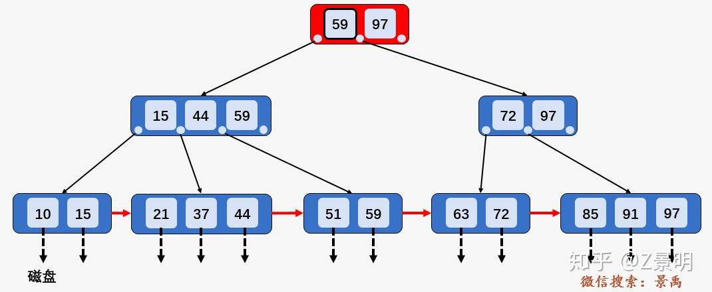
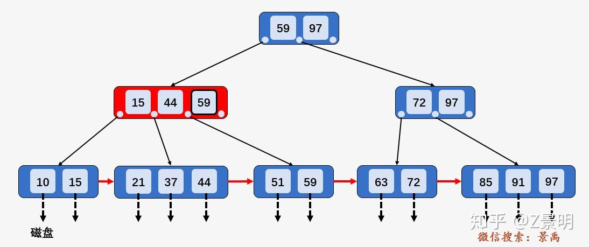
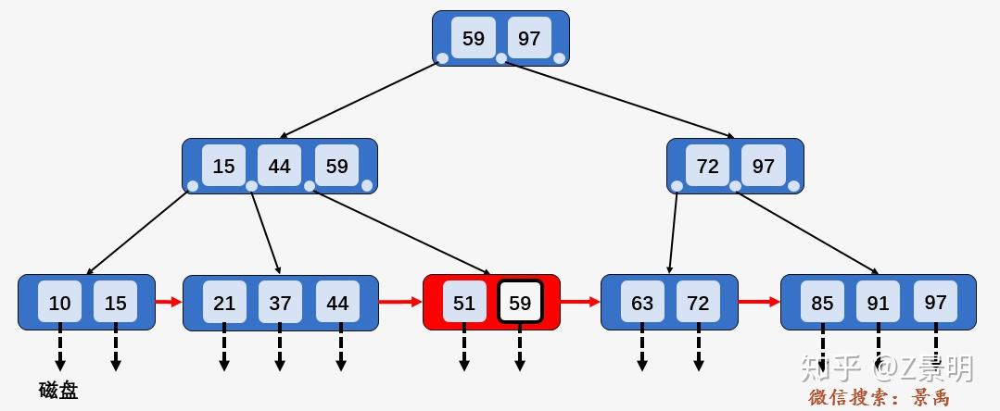
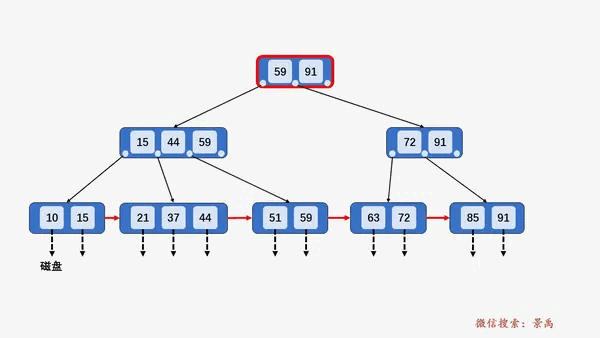
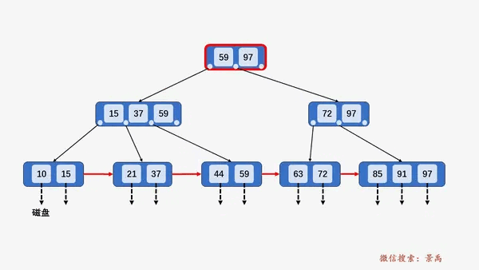

https://zhuanlan.zhihu.com/p/149287061

https://mp.weixin.qq.com/s/BXfogZuQ0NRYm24zh2NI9w

https://zhuanlan.zhihu.com/p/130698465

对于B+树而言，节点分成 leaf节点，internal内部节点，root节点

查找
对于 B+树中单个元素的查找而言，每一个元素都有相同的磁盘 I/O操作次数，
即使查询的元素出现在根结点中，但那只是一个充当控制查找记录的媒介，并不是数据本身，数据真正存在于叶子结点当中，
所以 B+树中查找任何一个元素都要从根结点一直走到叶子结点才可以

我们以查询 59 为例进行说明。
第一次磁盘 I/O ：访问根结点 [59、97] ，发现 59 小于等于 [59、97] 中的 59 ，则访问根结点的第一个孩子结点。

第二次磁盘 I/O : 访问结点 [15、44、59] ，发现 59 大于 44 且小于等于 59 ，则访问当前结点的第三个孩子结点 [51、59] .

第三次磁盘 I/O ：访问叶子结点 [51、59] ，顺序遍历结点内部，找到要查找的元素 59 .

分裂

节点类型的维度：

   1. 叶子节点的分裂
   B+树的叶子节点存储的是实际数据，且这些数据是按顺序排列的。
   当插入一个新的键值对时，如果叶子节点已经满了（节点的度数已达到最大），就需要进行分裂。
   规则：
   确定中间值：如果叶子节点已满，则找到其中的中间值（通常是中间位置的值），把叶子节点分为左右两部分。
   中间值上升到父节点：将中间值上升到父节点，使得父节点作为这个叶子节点分裂的“路标”，用来区分左右两个新叶子节点的范围。
   叶子节点指针的调整：分裂后的两个叶子节点会通过链表连接，保持所有叶子节点之间的顺序（这是B+树的特点，所有叶子节点通过链表相连）。
   例子：
   假设度数为3的B+树叶子节点存储 [3, 5, 8]，插入9后节点变满：
   找到中间值8，分裂成 [3, 5] 和 [9] 两个叶子节点。
   中间值8上升到父节点，父节点指示范围。
   分裂后的叶子节点通过链表连接，保持顺序。

   2. 内部节点的分裂
         内部节点（非叶子节点）存储的是索引值（也就是各子节点的“分界值”）。
         内部节点的分裂规则类似于叶子节点，但内部节点存储的值仅用于索引，而不包含实际的数据。
         因此，分裂的操作更多是调整树的结构。
         规则：
         找到中间值：如果内部节点已满，则找到中间的索引值，将该节点分裂为两个节点。
         中间值上升：将中间的索引值上升到父节点。
         不保留中间值：与叶子节点不同，内部节点的分裂不会保留中间值。该中间值一旦上升到父节点，便充当新的“路标”，不再在原子节点中存在。
   
         3. 根节点的分裂
         当根节点也变满时，B+树的高度会增加，因为根节点需要分裂，并且会生成新的根节点。
            根节点的分裂规则与内部节点类似，但它的分裂会导致树的层数增加。
            规则：
            找到中间值：同样找到中间值，分裂根节点。
            中间值成为新根节点：不同于内部节点的分裂，根节点分裂后，中间值会上升成为新的根节点，导致树的层数增加。
            左右子树形成：根节点分裂后会形成两个子节点，这两个子节点的范围分别由新根节点的中间值分界。
            例子：
            假设根节点是 [5, 10, 15]，插入12后需要分裂：
            找到中间值10，分裂成两个子节点：左节点 [5] 和右节点 [12, 15]。
            中间值10上升成为新的根节点，树的层数增加。

节点个数的维度：

   1. 奇数节点数量的分裂
      如果节点中的键值数量是奇数，那么当这个节点被分裂时，通常会选择中间位置的键值进行提升。
      分裂后，中间键值不会留在原来的两个子节点中，而是提升到父节点，剩余的键值平均分配到两个子节点中
      假设一个叶子节点有 3 个键值 [1, 5, 8]，现在需要分裂： 中间键值是 5
   2. 偶数节点数量的分裂
      如果节点中的键值数量是偶数，那么中间没有一个明确的“中间键值”，
      在这种情况下，分裂时可以选择靠近中间的一个键值进行提升。通常的策略是：
      提升靠中间偏右的键值（即分裂后的右半部分的第一个键值）。
      分裂后，提升的键值不会留在原来的两个子节点中，而是提升到父节点
      一个叶子节点有 4 个键值 [1, 3, 5, 8]，现在需要分裂： 中间键值是 5

插入

1. 叶子节点的插入操作
*  叶子节点存储实际的数据值（键值对），当我们进行插入操作时，首先会查找到正确的叶子节点。
*  如果叶子节点没有满，插入操作就相对简单；如果叶子节点已满，就需要分裂。
*  步骤：
*  查找插入位置：根据B+树的查找特性，找到应该插入的叶子节点。
*  如果树的层数大于1，首先从根节点出发，逐层根据索引值找到相应的叶子节点。
*  插入元素：将新元素插入到叶子节点的正确位置，保证叶子节点内部数据的有序性。
*  处理叶子节点满的情况：
*  如果插入后叶子节点没有满，则插入操作完成。
*  如果叶子节点满了（即包含的元素个数等于最大度数），就需要进行分裂：
*  找到叶子节点的中间值。
*  将叶子节点分裂为两个节点，左节点包含比中间值小的元素，右节点包含比中间值大的元素。
*  将中间值上升到父节点，作为新分界点。
*  保持叶子节点的链表指针更新，使叶子节点保持按顺序相连。

*  2. 内部节点的插入操作
*  内部节点（非叶子节点）只存储索引值，用来指引搜索的方向。
*  当内部节点满时，也需要进行分裂。内部节点的插入操作与叶子节点的操作类似，但它只存储索引值，不包含具体的数据，因此处理稍有不同。
*  步骤：
*  查找插入位置：从根节点开始，根据索引值找到应该插入的叶子节点，逐层遍历内部节点。
*  插入中间值到父节点：如果叶子节点分裂了，中间值需要上升到父节点，此时父节点相当于接收一个新的索引值。
*  处理内部节点满的情况：
*  如果父节点没有满，则将中间值插入父节点即可。
*  如果父节点已满（存储的索引值达到了最大度数），则需要对父节点进行分裂：
*  找到中间值，分裂父节点为左右两个子节点。
*  中间值继续上升到上层节点，形成新的分界点。

*  3. 根节点的插入操作
*  当根节点执行插入操作时，如果根节点没有满，操作较为简单；
*  如果根节点满了，插入操作会导致树的高度增加，并生成新的根节点。
*  这是唯一一种导致树高度增加的插入情况。
*  步骤：
*  插入元素：根节点作为特殊的内部节点，插入索引值或接收子节点分裂上升的中间值。
*  处理根节点满的情况：
*  如果根节点没有满，插入索引值后操作完成。
*  如果根节点已满（即包含的索引值达到了最大度数），则根节点需要分裂：
*  找到根节点的中间值，将其上升到新根节点，分裂根节点为两个子节点。
*  形成新的根节点，并使树的层数增加。
*  新根节点只有一个值，它有两个子节点，分别是分裂后的左右节点。
* 
*  4. 加入操作的总结
*  叶子节点的插入：
*  查找到合适的叶子节点，将新元素插入保持顺序。
*  叶子节点满时进行分裂，中间值上升到父节点。
*  内部节点的插入：
*  内部节点负责存储索引值，如果下层节点分裂，中间值上升到父节点。
*  内部节点满时进行分裂，中间值上升到父节点，不在原节点保留。
*  根节点的插入：
*  根节点插入时，根节点满了会导致根节点分裂，树的高度增加。
*  新根节点上升，中间值成为新的根，树的层数增加。 
* 
*   5. 插入操作整体流程:
*   插入操作的整体流程可以归纳为以下几点：
*   查找插入位置：从根节点开始，依次找到合适的子节点或叶子节点。
*   插入新元素：如果目标节点没有满，直接插入；否则进行分裂。
*   处理节点分裂：分裂后的中间值上升到父节点，父节点接收中间值。
*   递归处理父节点的分裂：如果父节点也满了，继续分裂，直到根节点为止。
*   根节点分裂时树的高度增加：如果根节点满了，分裂根节点，增加树的高度

删除

1. 定位元素
    - 从 B+
      树的根节点开始查找，将待删除元素与当前节点中的关键字进行比较。如果待删除元素小于当前节点的关键字，就遍历左边的子树节点；如果待删除元素大于当前节点的关键字，就遍历右边的子树节点。然后查找到前面指向的路径的继续查找。这个过程会一直持续，直到找到包含待删除元素的叶子节点。

2. 在子节点中删除元素
    - 找到叶子节点后，从叶子节点的关键字序列中删除目标元素。删除后，需要检查叶子节点中的关键字数量是否满足 B +
      树的下限要求。一般来说，如果 B + 树的阶数为 m（表示一个节点最多有 m - 1 个关键字），那么叶子节点至少应该有 ⌈m/2⌉ - 1
      个关键字。
        - 例如，对于阶数 m = 5 的 B + 树，叶子节点最少应该有 ⌈5/2⌉ - 1 = 2 个关键字。如果删除元素后，叶子节点的关键字数量仍然不低于这个下限，那么删除操作就基本完成了。

3. 叶子节点关键字数量不足 - 借关键字(借用关键字的本质适当做索引，原有节点的被借用的值 不会在原有节点中删除
   相当于拷贝这个值到父节点)
    - 如果叶子节点中关键字数量低于下限，首先尝试从相邻的兄弟节点（左兄弟或右兄弟）借关键字。假设叶子节点为 N，其左兄弟节点为
      L，右兄弟节点为 R。
        - 如果 L 的关键字数量大于 > ⌈m/2⌉ - 1，可以从 L 借一个关键字。具体操作是：将 L 中的最大关键字（假设 L
          中的关键字是升序排列）上移到父节点中，替换父节点中分隔 L 和 N 的关键字，然后将父节点中的这个关键字下移到 N 中。
        - 类似地，如果 R 的关键字数量 > ⌈m/2⌉ - 1，可以从 R 借一个关键字。将 R 中的最小关键字上移到父节点中，替换父节点中分隔
          N 和 R 的关键字，然后将父节点中的这个关键字下移到 N 中。

4. 叶子节点关键字数量不足 - 合并节点
    - 如果相邻兄弟节点（左兄弟和右兄弟）的关键字数量都等于 ⌈m/2⌉ - 1，则无法借关键字，必须需要合并节点。
        - 如果选择与左兄弟节点 L 合并，将 N 中的关键字和 L 中的关键字合并成一个新的节点，这个新节点将取代原来的 L 和 N。
          同时，在父节点中删除分隔 L 和 N 的关键字，并且调整父节点中指向 L 和 N 的指针。
        - 同样，如果选择与右兄弟节点 R 合并，操作类似，将 N 和 R 中的关键字合并，在父节点中进行相应的关键字和指针调整。

5. 通过调节父节点
    - 当合并节点后，父节点的关键字数量可能会减少。如果父节点的关键字数量低于 ⌈m/2⌉ -
      1，就需要对父节点进行类似的调整（借关键字或合并节点）。这个过程可能会一直向上递归，直到根节点。

6. 处理根节点特殊情况
    - 如果在调整过程中，根节点的关键字数量变为 0，且根节点只有一个子节点，那么将这个子节点作为新的根节点，B + 树的高度减
      1。这是一种特殊情况，因为根节点是树的顶层节点，它的变化会影响树的整体结构

7. 当删除某结点中最大或者最小的关键字，就会涉及到更改其双亲结点一直到根结点中所有索引值的更改。

针对情况4和5同同时发生

删除关键字 63，当删除关键字后，该结点中只剩关键字 72，且其兄弟结点 [85、91] 中只有 2 个关键字，
所以将 [72] 和 [85、91] 进行合并，向上回溯，删除结点 [72、91] 当中的关键字 72 ，
此时结点中只有关键 91 ，不满足 B+树中结点关键字个数要求，
但其兄弟结点 [15、44、59] 中包含的 3 个关键字，所以从其兄弟结点当中借一个关键字 59 ,
再对其兄弟结点的父结点中的关键字进行调整，将关键字 59 替换为 44

针对4
我们以删除上面这个 B+树中的关键字 59 说明第 4 种情况，
首先查找到关键 59 所在结点 [44、59] ，发现该结点的兄弟结点 [21、37] 包含的关键字的个数 2 等于 ⌈M/2⌉，
所以删除关键字 59 ，并将结点 [21、37] 和 [44] 进行合并 [21、37、44] ，然后向上回溯，将所有关键字 59 替换为次最大的关键字 44

针对3
当删除某个关键字之后，结点中关键字个数小于 ⌈M/2⌉ ，则不符合 B+树的特性，则需要按照 3 he 4 两种情况分别处理。
以删除关键字 51 为例，由于其兄弟结点 [21、37、44] 中含有 3 个关键字，
所以可以选择借一个关键字 44，同时将双亲结点中的索引值 44 修改 37

针对7
以删除整颗 B+树中最大的关键字 97 为例，查找并删除关键字 97 ， 然后向上回溯，将所有关键字 97 替换为次最大的关键字 91
